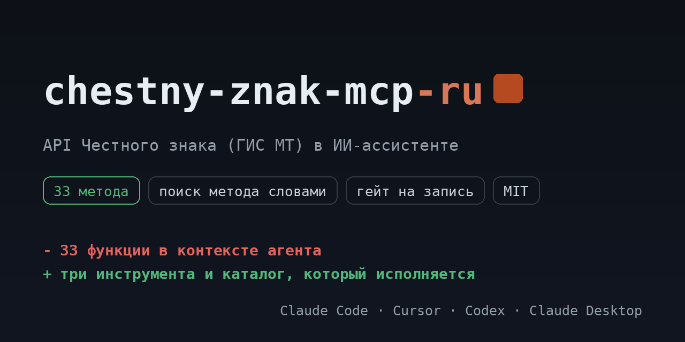

# chestny-znak-mcp-ru

<!-- mcp-name: io.github.ilyautov/chestny-znak-mcp-ru -->

API Честного знака (ГИС МТ и СУЗ) для ИИ-ассистентов: сведения о кодах маркировки, выгрузка по фильтру, маршрут товара по GTIN, заказы на эмиссию, отчёты о нанесении, проверка подлинности.

[](https://pypi.org/project/chestny-znak-mcp-ru/)
[](https://github.com/ilyautov/chestny-znak-mcp-ru/actions/workflows/ci.yml)
[](LICENSE)
[](#карта-методов)
[](https://business-mcp-ru.aifrontier.tech/chestny-znak-api.html)
[](https://github.com/ilyautov/chestny-znak-mcp-ru/stargazers)

[](https://vscode.dev/redirect/mcp/install?name=crpt&config=%7B%22command%22%3A%20%22uvx%22%2C%20%22args%22%3A%20%5B%22chestny-znak-mcp-ru%22%5D%2C%20%22env%22%3A%20%7B%22CRPT_TOKEN%22%3A%20%22%24%7Binput%3Acrpt_token%7D%22%7D%7D&inputs=%5B%7B%22id%22%3A%20%22crpt_token%22%2C%20%22type%22%3A%20%22promptString%22%2C%20%22description%22%3A%20%22%D0%A2%D0%BE%D0%BA%D0%B5%D0%BD%20%D0%93%D0%98%D0%A1%20%D0%9C%D0%A2%2C%20%D0%B2%D1%8B%D0%B4%D0%B0%D1%91%D1%82%D1%81%D1%8F%20%D0%B2%20%D0%BE%D0%B1%D0%BC%D0%B5%D0%BD%20%D0%BD%D0%B0%20%D0%B4%D0%B0%D0%BD%D0%BD%D1%8B%D0%B5%2C%20%D0%BF%D0%BE%D0%B4%D0%BF%D0%B8%D1%81%D0%B0%D0%BD%D0%BD%D1%8B%D0%B5%20%D0%9A%D0%AD%D0%9F.%20%D0%96%D0%B8%D0%B2%D1%91%D1%82%20%D0%BE%D0%BA%D0%BE%D0%BB%D0%BE%2010%20%D1%87%D0%B0%D1%81%D0%BE%D0%B2.%22%2C%20%22password%22%3A%20true%7D%5D)
[](https://cursor.com/en/install-mcp?name=crpt&config=eyJjb21tYW5kIjogInV2eCIsICJhcmdzIjogWyJjaGVzdG55LXpuYWstbWNwLXJ1Il0sICJlbnYiOiB7IkNSUFRfVE9LRU4iOiAiIn19)

<p align="center">
  <a href="https://business-mcp-ru.aifrontier.tech/">
    
  </a>
</p>

Каталог собран из первоисточника (открытые SDK True API и СУЗ) и лежит в репозитории как
`crpt_mcp/endpoints.yaml`: **33 метода**, из них 24 на чтение,
9 на запись и 0 необратимых. Сервер исполняет ровно этот файл,
поэтому таблица ниже не может разойтись с кодом.

> Документация ЦРПТ открывается только после входа по КЭП, публичной спеки нет: `/api/v3/true-api/swagger.json` отдаёт 401. Пути здесь взяты из открытых SDK, и у каждой записи каталога стоит `verified: false`. Это карта для разведки: пути надёжные, глаголы и параметры нужно подтвердить на живом контуре. Сервер показывает этот статус в `describe_method`, чтобы агент не выдавал догадку за факт.

## Установка

```bash
uvx chestny-znak-mcp-ru
```

Claude Desktop, `claude_desktop_config.json`:

```json
{
  "mcpServers": {
    "crpt-mcp": {
      "command": "uvx",
      "args": ["chestny-znak-mcp-ru"],
      "env": { "CRPT_TOKEN": "..." }
    }
  }
}
```

## Ключи

`GET /api/v3/true-api/auth/key` отдаёт случайные данные, их подписывают КЭП через КриптоПро на машине пользователя, а `POST /api/v3/true-api/auth/simpleSignIn` меняет подпись на токен. Токен живёт около 10 часов. Закрытый ключ в сервер не попадает.

| переменная | секрет | что это |
|---|---|---|
| `CRPT_TOKEN` | да | Токен ГИС МТ, выдаётся в обмен на данные, подписанные КЭП. Живёт около 10 часов. |

Ключи можно не держать в окружении: сервер умеет кабинеты и кладёт их в
`~/.ru-mcp/cabinets.json` с правами 600, вне репозитория.

## Карта методов

| раздел | методов | чтение | запись | необратимое |
|---|---|---|---|---|
| Проверка кодов | 8 | 7 | 1 | 0 |
| Коды маркировки | 6 | 5 | 1 | 0 |
| Заказы на эмиссию | 5 | 3 | 2 | 0 |
| Служебные | 4 | 4 | 0 | 0 |
| Чеки | 3 | 1 | 2 | 0 |
| Авторизация | 2 | 1 | 1 | 0 |
| Документы ГИС МТ | 2 | 2 | 0 | 0 |
| Отчёты о нанесении | 2 | 0 | 2 | 0 |
| Товары и GTIN | 1 | 1 | 0 | 0 |
| **всего** | **33** | **24** | **9** | **0** |

## Как это выглядит в чате

Вы: коды маркировки в обороте

```
crpt_search_methods("коды маркировки в обороте")
  crpt_gis_cises_my      GET  /api/v3/true-api/cises/my  чтение
  crpt_gis_cis_outcheck  GET  /api/v1/cis/outCheck       чтение
  crpt_suz_codes         GET  /api/v3/codes              чтение

crpt_describe_method("crpt_gis_cises_my")
  Коды маркировки, принадлежащие участнику оборота
  GET markirovka.crpt.ru/api/v3/true-api/cises/my
  параметры: нет
  класс доступа: чтение

crpt_call_method("crpt_gis_cises_my", {})
```

Три инструмента вместо 33 функций: агент ищет метод словами,
читает его карточку и вызывает. Запись и необратимое спрашивают подтверждение.

Что обычно просят:

- Проверить пачку кодов маркировки перед приёмкой товара.
- Посмотреть статус заказа на эмиссию кодов в СУЗ.
- Выгрузить коды, принадлежащие участнику оборота.
- Посмотреть маршрут товара по GTIN.

## Безопасность

Сервер работает на машине пользователя, ключи наружу не уходят. У методов три
класса доступа: чтение идёт сразу, запись и необратимые действия требуют
подтверждения. Заголовок авторизации не покидает домены сервиса даже при вызове
произвольного пути.

## Проверить установку

```bash
uvx chestny-znak-mcp-ru doctor
```

Печатает, сколько методов загрузилось, найдены ли ключи и откуда. Секреты не
показывает. С `--live` делает один дешёвый реальный вызов на чтение.

## Родня

Ядро вынесено в [schema-mcp-core](https://github.com/ilyautov/schema-mcp-core).
Соседние серверы: [hh-mcp-ru](https://github.com/ilyautov/hh-mcp-ru), [vk-mcp-ru](https://github.com/ilyautov/vk-mcp-ru), [diadoc-mcp-ru](https://github.com/ilyautov/diadoc-mcp-ru), [sbis-mcp-ru](https://github.com/ilyautov/sbis-mcp-ru).
Маркетплейсы живут отдельно: [marketplaces-mcp-ru](https://github.com/ilyautov/marketplaces-mcp-ru).

MIT. Автор [Илья Утов](https://github.com/ilyautov).
